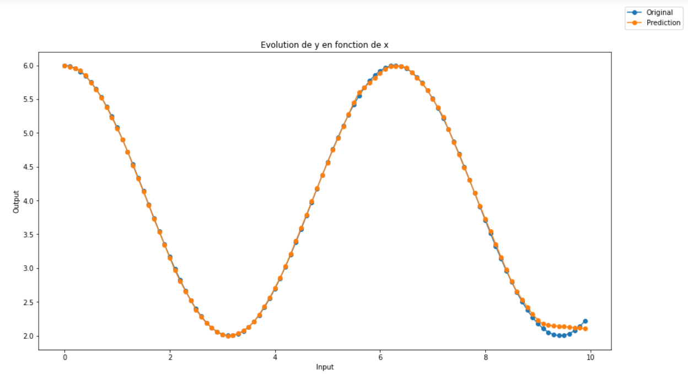

# Test Technique _ Vincent Bardonnet

Une fois le fichier "requirements.txt" dans le même dossier que le __ipynb__ lancer la ligne suivante pour installer les dépendances. 
> !python -m pip install -r requirements.txt

## Exercice 1
> Le but est de réaliser un programme capable de __donner un jour et l'horaire__(au format: `jour hh:mm-hh:mm`) pour un meeting d'__1heure__ pouvant être placé(s) en semaine: 
> + pour des horaires de travail allant __de 8h à 17h59__ du lundi(int(1)) au vendredi(int(5)) .
> + en fonction des __horaires d'indisponibilité__ de chaque personne sous forme de liste et au `même format`.

**Résultats** : 

J'ai créé un dataframe des indisponibilité tout en ayant convertit les `hh:mm` en `minutes` pour simplifier et améliorer la visibilité.
On obtient une __liste exhaustive__ de toutes les horaires possibles pour une réunion d'1 heure entre les heures de travail et où tout le monde est disponible.

**Limite** : 

+ le problème principal est que je n'ai pas trouvé comment prendre en compte le fait qu'il puisse y avoir __une plage de disponibilité entre plusieurs plages d'indisponibilité pour un même jour__.

## Exercice 2

> L'objectif est d'approximer un fonction `y=2*cos(x)+4` pour x allant de 0 à 10 à l'aide d'un réseau de neurones.

**Résultats** :

  

On peut voir la limite de mon modèle qui semble mal s'adapter aux courbures vers `input = [9,10]`. 
J'ai utilisé numpy arange() pour créer un jeu de données équilibré et plus lisse en input. On a donc plus de points qu'avec un simple array de cette forme `np.array([i for i in range(0,10)])` néanmoins il m'a fallut alors jouer sur d'autres paramètres pour compenser cette compléxification, notamment ajouter plus de neurones (ex: augmenter le nombre de couches cachées) revient a augmenter le nombre de fonctions de base pour l'approximation ce qui augmente la précision. On peut jouer sur d'autres paramètres comme l'algorithme d'apprentissage, le choix d'activation des neurones, le nombre d'epochs, la taille des batchs (marge faible car très petit jeu de données).

*__Optimized Approximation Algorithm in Neural Networks Without Overfitting__-Yinyin Liu,Janusz A. Starzyk,Zhen Zhu*

**Limite**:

+ Il s'agit d'un jeu assez cours, il aurait donc pu être pas mal d'implémenter une méthode de recherche des meilleurs hyperparamètres comme `GridSearchCv` qui je crois peut s'appliquer ici mais je n'ai pas eu le temps.

__Conclusion__ :

Je n'avais pas encore fait d'approximation de fonction en utilisant des réseaux de neurones, néanmoins un problème qui se pose sur ce genre d'exercice est celui d'overfitting (sur-apprentissage des données d'entrées).

En général, l'overfitting se manifeste par l'augmentation de l'erreur sur les données de test. Cependant pour l'approximation de fonction on ne cherche pas à prédire des valeurs mais à voir si le réseau de neurones arrive à s'approcher de la fonction pour le peu de données qu'il a appris. 

J'ai quand même essayé de mettre en évidence le problème d'overfitting en doublant la taille du jeu de données pour créer un train et un test, mais on passe alors à un objectif de prédiction et il faudrait alors changer structure de mon modèle. De plus on s'éloignait je pense de la question initiale.